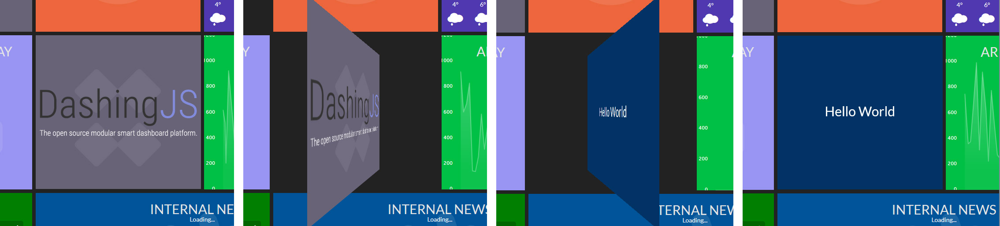

<p align="center">
	<a href="https://david-dm.org/MikhaelGerbet/dashingJs"></a>
	<a href="https://david-dm.org/MikhaelGerbet/dashingJs#info=devDependencies"></a>
	<a href="http://choosealicense.com/licenses/mit"></a>
	<a href="https://snyk.io/test/github/MikhaelGerbet/dashingJs"></a>
</p>
**DashingJS** is a open source AngularJS based framework that lets you build beautiful dashboards. 
With a growing list of installable modules, **DashingJS** is your new dashboard. **DashingJS** is Inspired by the the original Ruby project [dashing.io](http://dashing.io/). 

[](https://MikhaelGerbet.github.io/dashingJs)

**Table of contents**

<!-- START doctoc generated TOC please keep comment here to allow auto update -->
<!-- DON'T EDIT THIS SECTION, INSTEAD RE-RUN doctoc TO UPDATE -->


- [Usage](#usage)
  - [Raspberry Pi Support](#raspberry-pi-support)
  - [Automatic Installer (Raspberry Pi Only!)](#automatic-installer-raspberry-pi-only)
  - [Raspberry Configuration & Auto Start.](#raspberry-configuration-&-auto-start)
  - [Updating your DashingJS](#updating-your-dashingjs)
- [Configuration](#configuration)
  - [Dashboard configuration](#dashboard-configuration)
  - [Widgets configurations](#widgets-configurations)
    - [Flipmode](#flipmode)
- [Jobs](#jobs)
- [Widgets](#widgets)
- [Contributing Guidelines](#contributing-guidelines)

<!-- END doctoc generated TOC please keep comment here to allow auto update -->

## Usage

### Raspberry Pi Support
The Raspberry Pi 1, 2, 3, (and more) are currently supported. But, it's recommended to use an
[Raspberry P1 3 model B](https://www.raspberrypi.org/products/raspberry-pi-3-model-b/)
with [Raspbian Jessie OS](https://www.raspberrypi.org/downloads/raspbian/) to enjoy a better experience.

### Automatic Installer (Raspberry Pi Only!)

Execute the following command on your Raspberry Pi to install DashingJS:
````
curl -sL https://raw.githubusercontent.com/MikhaelGerbet/dashingJs/master/installers/raspberry.sh | bash
````

### Raspberry Configuration & Auto Start.

The following wiki links are helpful in the configuration of your DashingJs operating system:
- [Configuring the Raspberry Pi](https://github.com/MikhaelGerbet/dashingJs/wiki/Configuring-the-Raspberry-Pi)
- [Auto Starting DashingJs](https://github.com/MikhaelGerbet/dashingJs/wiki/Auto-Starting-DashingJs)

### Updating your DashingJS

If you want to update your DashingJS to the latest version, use your terminal to go to your DashingJS folder and type the following command:

```bash
git pull
```

If you changed nothing more than the config or the modules, this should work without any problems.
Type `git status` to see your changes, if there are any, you can reset them with `git reset --hard`. After that, git pull should be possible.

## Configuration

1. Duplicate `app/config.js.sample` to `app/config.js`.
2. Modify your required settings.

> These settings are configurable in your config file

`./app/config.js`

### Dashboard configuration

You can customize your dashboard with the parameters below :

|name|type|default|require|description|
|:---:|:---:|:---:|:---:|:---:|
|lang|string|en|true|_Dashboard language_|
|columns|int|5|true|_Collumns number_|
|margins|[float,float]|[8,8]|true|_Margins beetwen widgets_|
|rowHeight|float|357.3|true|_Row height_|
|colWidth|float|382.5|true|_Col width_|
|items|array|[]|true|_Widgets configurations_|

Exemple :

```js
var config = {
    lang: 'en',
    columns: 5,
    margins: [8,8],
    rowHeight : 357.3,
    colWidth : 382.5,
    items : []
} ;
```
### Widgets configurations

You can customize the widgets from your dashboard with the parameters below :

|name|type|default|require|description|
|:---:|:---:|:---:|:---:|:---:|
|sizeX|int|1|true|_Widget size X_|
|sizeY|int|1|true|_Widget size Y_|
|row|int|0|true|_Widget row position_|
|col|int|0|true|_Widget col position_|
|background or null|string|#222222|true|_Widget background color (rgb value only)_|
|icon|string or null|#222222|true|_Widget background icon (font awesome icon class only without "fa-")_|
|widget|string or null|null|true|_Widget name_|
|params|object|{}|true|_Widget params_|

Exemple :

```js
var config = {
    [...]
    items : [
        { sizeX: 1, sizeY: 1, row: 0, col: 0, background: '#686377', icon: null, widget: 'image', params: {image:'images/logo.png'}},
        { sizeX: 1, sizeY: 1, row: 0, col: 1, background: '#ec663c', icon: 'clock-o', widget: 'date', params: {date: true, clock: true}},
        { sizeX: 1, sizeY: 1, row: 1, col: 0, background: null, icon: null, widget: 'value', params: {job: 'jobValueA', interval: 50000, title: 'clients', symbole: '', goal: '75 at 01/01/17'}}
        [...]
    ]
} ;
```

#### Flipmode

The "Flipmode" allows two widgets on the same location (front / back).
The location rotated 180 ° with a 3D effect to display widgets.
You can have twice as widget on your dashboard.

You can customize the Flipmode  :

|name|type|description|
|:---:|:---:|:---:|
|interval|int|_milliseconds between rotations_|
|front|object|_Widget configuration front_|
|back|object|_Widget configuration back_|


Exemple :

```js
var config = {
    [...]
    items : [
        {
            sizeX: 1,
            sizeY: 1,
            row: 0,
            col: 0,
            flip : {
                interval: 5000,
                front : {
                    background : '#686377',
                    icon : null,
                    widget : 'image',
                    params : {
                        image : 'images/logo.png'
                    }
                },
                back : {
                    background : '#686377',
                    icon : null,
                    widget : 'helloworld',
                    params : {}
                }
            }
        },
    [...]
    ]
} ;
```

_Preview :_




## Jobs

Some of your widgets have external data needs. For example, if you want to display the number of your customers on your *awesome* dashboard,
you're definitely going to need to call your API. You can configure jobs to transfer your data to your widgets through jobs.

1. Duplicate `app/jobs.js.sample` to `app/jobs.js`.
2. Modify your jobs settings.

Jobs exemple :

```js
'use strict';

dashingJs.
factory('jobA',function($http){
    return {
        getValue: function(){
            return $http.get('http://localhost:9000/server/valueA.yml');
        }
    }
}).
factory('jobB',function($http){
    return {
        getValue: function(){
            return $http.get('http://localhost:9000/server/valueB.yml');
        }
    }
});
```

And the widgets configuration will be:

```js
var config = {
    [...]
    items : [
        [...]
        { sizeX : 1, sizeY : 1, row : 1, col : 0, background : '#9895F2', icon : null, widget : 'value', params : {job : 'jobA', interval : 50000, title : 'My Value A'}},
        { sizeX : 1, sizeY : 1, row : 1, col : 1, background : '#9895F2', icon : null, widget : 'value', params : {job : 'jobB', interval : 50000, title : 'My Value B'}},
        [...]
    ]
} ;
```

> These jobs are configurable in your jobs file

`./app/scripts/jobs.js`


## Widgets

The following widgets are installed by default.

- [**area**](app/widgets/area)
- [**barchart**](app/widgets/barchart)
- [**cci**](app/widgets/cci)
- [**date**](app/widgets/date)
- [**donut**](app/widgets/donut)
- [**facebookLike**](app/widgets/facebookLike)
- [**giphy**](app/widgets/giphy)
- [**googleAnalytics**](app/widgets/googleAnalytics)
- [**helloworld**](app/widgets/helloworld)
- [**image**](app/widgets/image)
- [**jira**](app/widgets/jira)
- [**slack**](app/widgets/slack)
- [**teamMood**](app/widgets/teamMood)
- [**upSites**](app/widgets/upSites)
- [**value**](app/widgets/value)
- [**velib**](app/widgets/velib)
- [**weather**](app/widgets/weather)

## Contributing Guidelines

Contributions of all kinds are welcome, not only in the form of code but also with regards bug reports and documentation.

Please keep the following in mind:

- **Bug Reports**:  Make sure you're running the latest version. If the issue(s) still persist: please open a clearly documented issue with a clear title.
- **Minor Bug Fixes**: Please send a pull request with a clear explanation of the issue or a link to the issue it solves.
- **Major Bug Fixes**: please discuss your approach in an GitHub issue before you start to alter a big part of the code.
- **New Features**: please please discuss in a GitHub issue before you start to alter a big part of the code. Without discussion upfront, the pull request will not be accepted / merged.


## Testing

There are two kinds of tests in DashingJS: Unit tests and end-to-end tests.

### Running Unit Tests

DashingJS comes preconfigured with unit tests. These are written in
[Jasmine][jasmine], which we run with the [Karma Test Runner][karma]. We provide a Karma
configuration file to run them.

* the configuration is found at `karma.conf.js`
* the unit tests are found next to the code they are testing and are named as `..._test.js`.

The easiest way to run the unit tests is to use the supplied npm script:

```
npm test
```

This script will start the Karma test runner to execute the unit tests. Moreover, Karma will sit and
watch the source and test files for changes and then re-run the tests whenever any of them change.
This is the recommended strategy; if your unit tests are being run every time you save a file then
you receive instant feedback on any changes that break the expected code functionality.

You can also ask Karma to do a single run of the tests and then exit.  This is useful if you want to
check that a particular version of the code is operating as expected.  The project contains a
predefined script to do this:

```
npm run test-single-run
```


### End to end testing

DashingJS comes with end-to-end tests, again written in [Jasmine][jasmine]. These tests
are run with the [Protractor][protractor] End-to-End test runner.  It uses native events and has
special features for Angular applications.

* the configuration is found at `e2e-tests/protractor-conf.js`
* the end-to-end tests are found in `e2e-tests/scenarios.js`

Protractor simulates interaction with DashingJS and verifies that the application responds
correctly. Therefore, our web server needs to be serving up the application, so that Protractor
can interact with it.

```
npm start
```

In addition, since Protractor is built upon WebDriver we need to install this. DashingJS comes with a predefined script to do this:

```
npm run update-webdriver
```

This will download and install the latest version of the stand-alone WebDriver tool.

Once you have ensured that the development web server hosting our application is up and running
and WebDriver is updated, you can run the end-to-end tests using the supplied npm script:

```
npm run protractor
```

This script will execute the end-to-end tests against the application being hosted on the
development server.

**Note:**
Under the hood, Protractor uses the [Selenium Standalone Server][selenium], which in turn requires
the [Java Development Kit (JDK)][jdk] to be installed on your local machine. Check this by running
`java -version` from the command line.

If JDK is not already installed, you can download it [here][jdk-download].


Thanks for your help in making DashingJS better!


