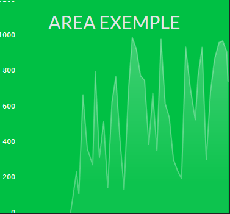

# The Area Widget

**Table of contents**

<!-- START doctoc generated TOC please keep comment here to allow auto update -->
<!-- DON'T EDIT THIS SECTION, INSTEAD RE-RUN doctoc TO UPDATE -->


- [Preview](#preview)
- [Parameters](#parameters)

<!-- END doctoc generated TOC please keep comment here to allow auto update -->

## Preview



## About Area Widget

With Area Widget, display the stats in live.

## Parameters

> These settings are configurable in your config file

`./app/config.js`

|name|type|default|require|description|
|:---:|:---:|:---:|:---:|:---:|
|title|string|'Area exemple'|true|_The widget title_|
|job|string|null|true|_The job name_|
|nbsPoints|int|50|false|_Number of points_|
|interval|int|1000|false|_Get data in millisegondes_|


_config exemple :_

```js
var config = {
    items : [
        {
            sizeX : 1,
            sizeY : 1,
            row : 1,
            col : 2,
            background : '#00C044',
            icon : null,
            widget : 'area',
            params : {
                interval: 1000,
                job: 'jobArea',
                nbsPoints : 50,
                title : 'area exemple'
            }
        }
    ]
}
```