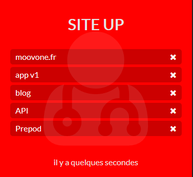

# UpSites Widget

###### With UpSites Widget, test if your sites are available and view the results on your awesome dashboard !

**Table of contents**

<!-- START doctoc generated TOC please keep comment here to allow auto update -->
<!-- DON'T EDIT THIS SECTION, INSTEAD RE-RUN doctoc TO UPDATE -->


- [Preview](#preview)
- [Parameters](#parameters)

<!-- END doctoc generated TOC please keep comment here to allow auto update -->


## Preview



The widget turns red if a site returns an error.

## Parameters

> These settings are configurable in your config file

`./app/config.js`

|name|type|default|require|description|
|:---:|:---:|:---:|:---:|:---:|
|interval|int|true|true|_Refresh in millisecondes_|
|sites|array|[]|true|_sites list_|

_config exemple :_

```js
var config = {
    items : [
        {
            sizeX: 1,
            sizeY: 1,
            row: 2,
            col: 0,
            background: '#26A31C',
            icon: 'user-md',
            widget: 'upSites',
            params: {
                interval:120000,
                sites: [
                    {name:'google.fr', url:'http://google.fr'},
                    {name:'facebook', url:'http://facebook.com'},
                    {name:'twitter', url:'http://twitter.com'}
                ]
            }
        }
    ]
}
```