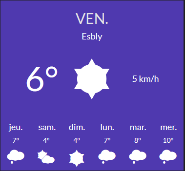

# The Weather Widget

**Table of contents**

<!-- START doctoc generated TOC please keep comment here to allow auto update -->
<!-- DON'T EDIT THIS SECTION, INSTEAD RE-RUN doctoc TO UPDATE -->


- [Preview](#preview)
- [Parameters](#parameters)

<!-- END doctoc generated TOC please keep comment here to allow auto update -->

## Preview



## About Weather Widget

With Weather Widget, display the current weather and the forecast of 6 days.
use [Open Weather Map API](https://openweathermap.org/api) (free API) but, but you will need a key to use its data.
Weather Widget has an IP geolocation service to automatically detect your location.

## Parameters

> These settings are configurable in your config file

`./app/config.js`

|name|type|default|require|description|
|:---:|:---:|:---:|:---:|:---:|
|OpenWeatherMapKey|string|true|true|_YOUR_OPEN_WEATHER_MAP_KEY_|

_config exemple :_

```js
var config = {
    items : {
        { sizeX : 1, sizeY : 1, row : 1, col : 4, background : '#00A86A', icon : null, widget : 'weather', params : {key:'_YOUR_OPEN_WEATHER_MAP_KEY_'}},
    }
}
```